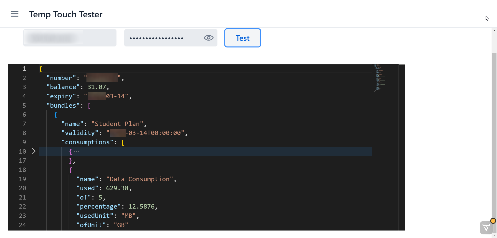
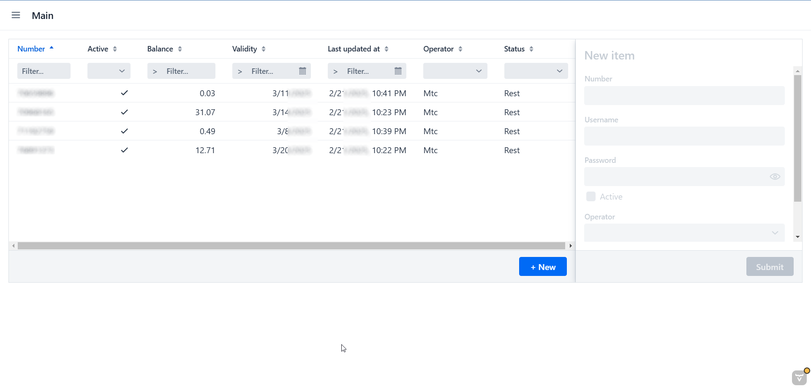

# Charrejli

## About
During the war, a lot of friends / family fled the country. As the "Computer guy" they only call when they want to setup their printers, ask if I want to join them in their next million dollar idea, or hack into their ex's instagram account. I somehow was the one responsible that their lines are properly recharged.

Now I for myself don't use my phone and often forget to recharge it. How about handling half of the country's numbers. So I created this small app in order to help me manage their number.

I didn't want to use a pbx or something like that. But I discovered that on the operator's website, I could get the data that I need. So I wrote scrapers in order to get said data (TODO: In the future I might explore checking the mobile apps APIs as on the web, it is server side rendered)

If you are only interested in the scraping parts check:
- [Touch](./src/main/java/com/mohammadalikassem/charrejli/modules/parsers/lb/touch/TouchParser.java)
- [Alfa](./src/main/java/com/mohammadalikassem/charrejli/modules/parsers/lb/alfa/AlfaParser.java)

I also added a telegram bot to keep me update it and remind me if any action is needed of if the consumption surpassed a specific threshold.

## Stack
This App is built using react on the frontend and Spring on the backend with hilla acting as the glue layer between the two of them. A couple of small problems with hilla aside. I really liked the idea behind it. To the point where I created a debug UI to test stuff instead of writing a log to the console

And with the power of the springboot ecosystem. the sky is the limit.

## Basically that's it

## TODOs:

- [ ] Add actions like transferring balance, recharging etc...
- [ ] Clean and push telegram bot part
- [ ] Add rule engine and link to notification provider
- [ ] Add auth , groups , users permissions etc
- [ ] Add PWA with push notification